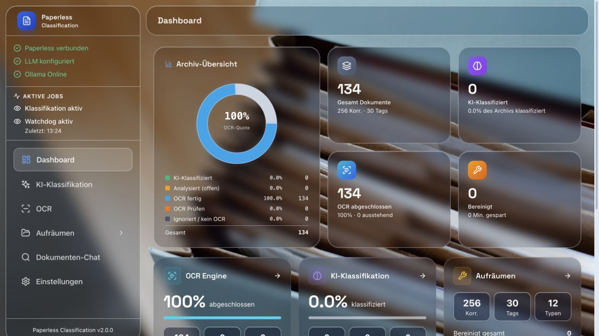
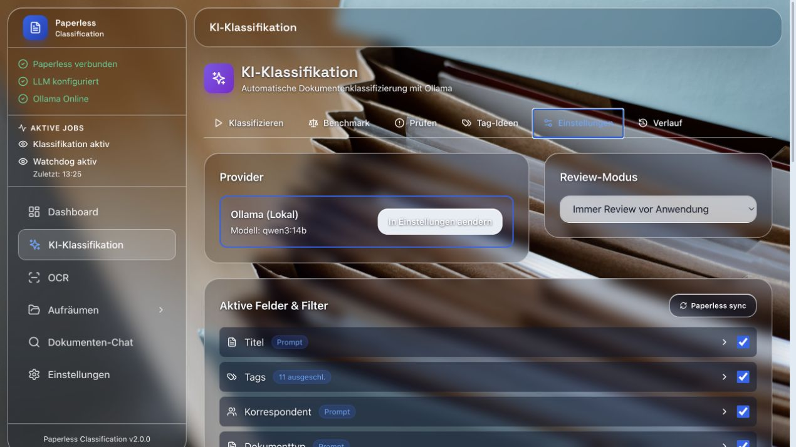
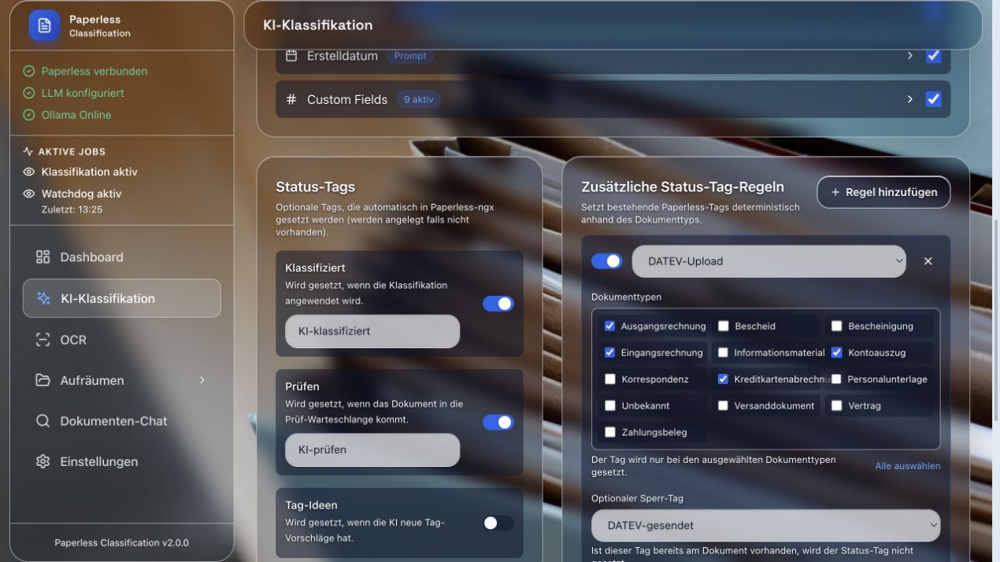
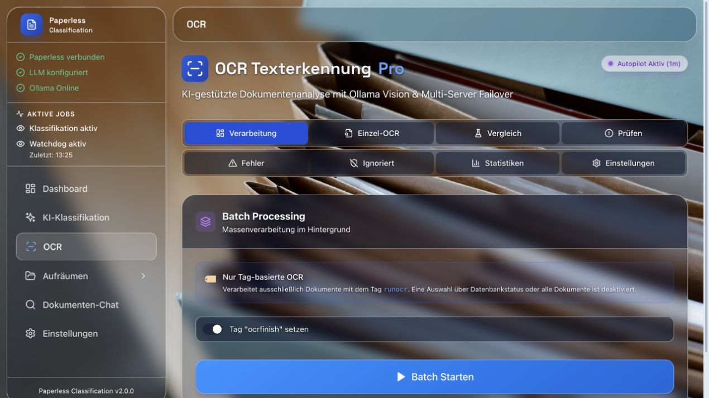
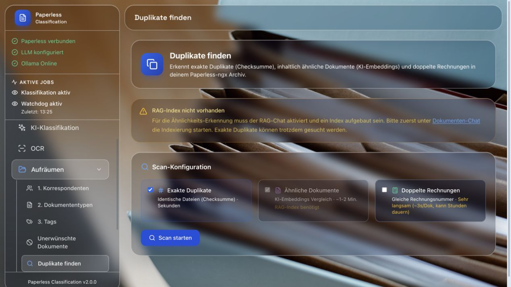

<div align="center">

# Paperless Classification

**KI-Klassifikation, OCR, Metadaten-Bereinigung, Dokumenten-Chat und Duplikatprüfung für Paperless-ngx**

[](https://github.com/chrschacht/paperless-classification/releases)
[](https://github.com/chrschacht/paperless-classification/pkgs/container/paperless-classification-backend)
[](LICENSE)



</div>

Paperless Classification ergänzt eine vorhandene Paperless-ngx-Installation. Die Anwendung kann bestehende und neue Dokumente klassifizieren, OCR-Ergebnisse prüfen und verbessern, Metadaten bereinigen, Dokumente per RAG durchsuchen und mögliche Duplikate finden.

> **Wichtig:** Die Anwendung verändert Metadaten und kann – nach ausdrücklicher Bestätigung – Merge- oder Löschaktionen in Paperless-ngx ausführen. Vor der ersten Nutzung und vor jedem Update ist ein vollständiges Backup erforderlich.

## Funktionen

| Bereich | Funktionen |
|---|---|
| **KI-Klassifikation** | Titel, Tags, Korrespondent, Dokumenttyp, Datum, Speicherpfad und Custom Fields; manuell, mit Review oder automatisch |
| **Pflichtfelder** | Dokumenttypabhängige Pflichtfelder, einmalige Force-OCR-Wiederholung und Eskalation zu `KI-prüfen` |
| **OCR** | Ollama Vision, Smart-Skip für gutes vorhandenes OCR, Einzel- und Batchverarbeitung, Watchdog und Multi-Server-Failover |
| **Aufräumen** | Korrespondenten, Dokumenttypen und Tags analysieren und kontrolliert zusammenführen |
| **Duplikate** | Prüfsummen, semantische Ähnlichkeit und doppelte Rechnungen |
| **Dokumenten-Chat** | Hybride Volltext- und Vektorsuche mit Quellenangaben |
| **Provider** | Ollama für lokale Verarbeitung oder OpenAI als Cloud-Provider |
| **Betrieb** | Multi-Arch-Container für `amd64` und `arm64`, SQLite, Konfigurationsimport/-export |

Cloud Sync / Import ist nicht Bestandteil von Paperless Classification. Dokumente werden ausschließlich aus Paperless-ngx verarbeitet.

## Schnellstart

### Voraussetzungen

- laufende Paperless-ngx-Installation mit API-Token
- Docker Engine mit Docker Compose
- entweder Ollama mit passenden Modellen oder ein OpenAI-API-Schlüssel
- empfohlen: Reverse Proxy mit HTTPS und Authentifizierung

### Installation mit veröffentlichten Images

```bash
mkdir -p ~/paperless-classification
cd ~/paperless-classification
curl -LO https://raw.githubusercontent.com/chrschacht/paperless-classification/main/docker-compose.yml
curl -Lo .env.example https://raw.githubusercontent.com/chrschacht/paperless-classification/main/.env.example
cp .env.example .env
docker compose pull
docker compose up -d
```

Die Weboberfläche ist anschließend standardmäßig unter <http://localhost:3001> erreichbar. Sie wird bewusst nur an `127.0.0.1` gebunden.

### Version fest pinnen

Für produktive Installationen wird eine feste Version statt `latest` empfohlen:

```yaml
services:
  backend:
    image: ghcr.io/chrschacht/paperless-classification-backend:2.0.1
  frontend:
    image: ghcr.io/chrschacht/paperless-classification-frontend:2.0.1
```

### Erster Start

1. Unter **Einstellungen** Paperless-ngx-URL und API-Token eintragen.
2. Ollama oder OpenAI konfigurieren und Verbindung testen.
3. Unter **KI-Klassifikation → Einstellungen** Felder und Review-Modus festlegen.
4. Ein Testdokument manuell klassifizieren und das Ergebnis prüfen.
5. OCR und automatische Klassifikation erst nach erfolgreichem Abnahmetest aktivieren.

## KI-Klassifikation



Jedes Feld kann separat aktiviert und mit einem eigenen Zusatzprompt eingeschränkt werden. Paperless-Zielwerte lassen sich synchronisieren und über Ausschlusslisten begrenzen. Die manuelle Vorschau zeigt auch Status- und Bearbeitungs-Tags so, wie sie bei der Anwendung gesetzt oder entfernt würden.

### Status-Tags und Regeln



Neben den grundlegenden Tags für „klassifiziert“, „prüfen“ und „Tag-Ideen“ können zusätzliche Regeln anhand des erkannten Dokumenttyps konfiguriert werden. Ein optionaler Sperr-Tag verhindert doppelte Bearbeitung.

### Pflichtfelder und erneute OCR

Kann ein Pflichtfeld nicht befüllt werden, wird einmalig eine neue OCR über `forceocr` angefordert. Dabei wird `ocrfinish` entfernt. Nach erfolgreicher OCR wird `ocrfinish` erneut gesetzt und die Klassifikation wiederholt. Bleibt das Feld leer, endet die Schleife und das Dokument erhält `KI-prüfen`.

## OCR



Smart-Skip übernimmt guten vorhandenen Paperless-OCR-Text und verhindert dadurch unnötige Vision-OCR. Eine neue OCR erfolgt bei unzureichendem Text, typischen Modellartefakten oder einem expliziten `forceocr`-Tag. Dateigrößenlimit, Watchdog-Intervall und technische Bearbeitungstags sind konfigurierbar.

## Duplikate und Aufräumen



Exakte Duplikate werden über Prüfsummen erkannt. Semantisch ähnliche Dokumente verwenden den RAG-Index. Die Rechnungsprüfung berücksichtigt Rechnungsnummern und weitere Merkmale. Ergebnisse werden nicht automatisch gelöscht.

Metadaten-Bereinigungen analysieren die Namen von Korrespondenten, Dokumenttypen oder Tags und schlagen Gruppen vor. Der Benutzer bestimmt Ziel und Umfang jeder Zusammenführung.

## Dokumenten-Chat

Der RAG-Chat kombiniert BM25-Volltextsuche, Vektor-Embeddings und Reranking. Antworten enthalten Quellen aus dem Paperless-Archiv. Embeddings und Chat können vollständig lokal über Ollama oder – nach bewusster Datenschutzentscheidung – über OpenAI laufen.

## Datenschutz und Sicherheit

- Bei **Ollama** bleiben die verarbeiteten Inhalte innerhalb der selbst kontrollierten Infrastruktur.
- Bei **OpenAI** können OCR-Texte und gefundene Dokumentabschnitte an OpenAI übertragen werden.
- Die lokale Datei `data/organizer.db` kann Tokens und Konfiguration enthalten und muss vertraulich gesichert werden.
- Die Anwendung besitzt keine eigene vollständige Benutzerverwaltung. Für Netzwerkzugriffe sind Reverse Proxy, HTTPS und Authentifizierung erforderlich.
- Auto-Anwenden sollte erst nach einem dokumentierten Test freigegeben werden.

Details: [Sicherheit und Datenschutz](docs/SECURITY_AND_PRIVACY.md)

## Updates

```bash
cd ~/paperless-classification
docker compose pull
docker compose up -d
docker compose ps
```

Vor einem Major-Upgrade ist das vollständige `data/`-Verzeichnis zu sichern. Hinweise für Version 2.0 stehen in [docs/UPGRADE_V2.md](docs/UPGRADE_V2.md).

## Dokumentation

- [Benutzerhandbuch](docs/USER_GUIDE.md)
- [Installation auf macOS](INSTALLATION_MAC.md)
- [Sicherheit und Datenschutz](docs/SECURITY_AND_PRIVACY.md)
- [Upgrade auf Version 2.0](docs/UPGRADE_V2.md)
- [Release Notes 2.0.1](docs/RELEASE_NOTES_2.0.1.md)
- [Release Notes 2.0.0](docs/RELEASE_NOTES_2.0.0.md)
- [Prüf- und Abnahmecheckliste](INSTANCE_CHECKLIST.md)
- [Entwicklung](DEVELOPMENT.md)
- [Versionierung](VERSIONING.md)
- [Änderungsprotokoll](CHANGELOG.md)

## Entwicklung

```bash
git clone https://github.com/chrschacht/paperless-classification.git
cd paperless-classification
docker compose -f docker-compose.dev.yml up --build
```

Entwicklungsoberfläche: <http://localhost:18088><br>
API-Dokumentation: <http://localhost:18081/docs>

Frontend-Build:

```bash
cd frontend
npm ci
npm run build
```

Backend-Tests:

```bash
python -m pytest backend/tests
```

## Herkunft und Lizenz

Paperless Classification ist eine eigenständige Weiterentwicklung auf Basis von [AI Paperless Organizer](https://github.com/syberx/AI-Paperless-Organizer). Das ursprüngliche Projekt wurde unter der MIT-Lizenz veröffentlicht. Der erforderliche Copyright- und Lizenzhinweis bleibt vollständig in [LICENSE](LICENSE) erhalten. Weitere Angaben stehen in [THIRD_PARTY_NOTICES.md](THIRD_PARTY_NOTICES.md).

Das mitgelieferte Hintergrundfoto „Geöffneter Ordner für Dokumente auf dem Tisch“ stammt von Anete Lusina auf [Pexels](https://www.pexels.com/de-de/foto/geoffneter-ordner-fur-dokumente-auf-dem-tisch-4792288/). Details: [Bildnachweise](frontend/public/IMAGE_CREDITS.md).

## Haftung

Die Software wird ohne Gewährleistung bereitgestellt. Es gelten die Bedingungen der [MIT-Lizenz](LICENSE). Administratoren bleiben für Backups, Zugriffsschutz, Datenschutz und die Prüfung automatisch vorgeschlagener Änderungen verantwortlich.
